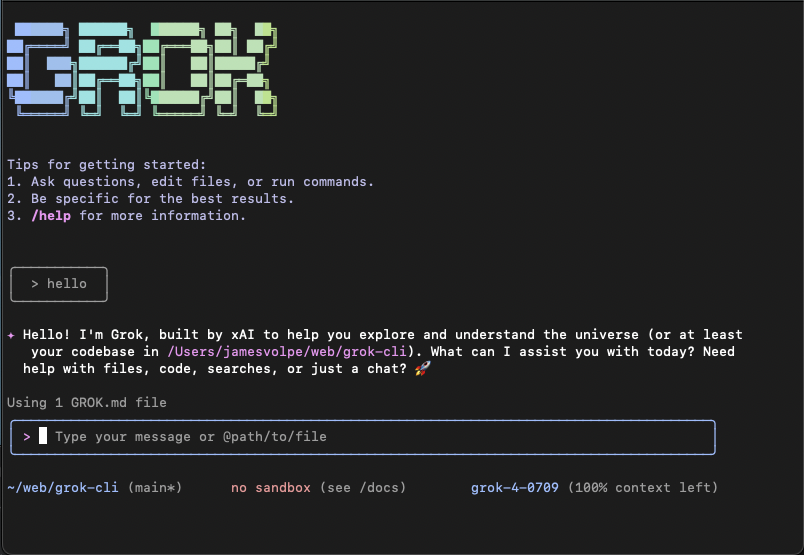

# Grok CLI

[](https://github.com/Volpestyle/grok-cli/actions/workflows/ci.yml)



> **Note:** This is a fork of the [Google Gemini CLI](https://github.com/google-gemini/gemini-cli) that has been modified to use xAI's Grok API instead of Google's Gemini API. All credit for the original architecture and design goes to the Google team.

This repository contains the Grok CLI, a command-line AI workflow tool that connects to your
tools, understands your code and accelerates your workflows using xAI's Grok models.

With the Grok CLI you can:

- Query and edit large codebases using Grok's powerful language understanding.
- Generate new apps from PDFs or sketches, using Grok's multimodal capabilities.
- Automate operational tasks, like querying pull requests or handling complex rebases.
- Use tools and MCP servers to connect new capabilities.
- Leverage Grok's real-time knowledge and reasoning abilities.

## Quickstart

1. **Prerequisites:** Ensure you have [Node.js version 20](https://nodejs.org/en/download) or higher installed.
2. **Get an xAI API key:** Sign up at [xAI Console](https://console.x.ai/) and create an API key.
3. **Set your API key:** Set it as an environment variable in your terminal:

   ```bash
   export GROK_API_KEY="your-api-key-here"
   ```

4. **Run the CLI:** Execute the following command in your terminal:

   ```bash
   npx https://github.com/Volpestyle/grok-cli
   ```

   Or install it with:

   ```bash
   npm install -g @volpestyle/grok-cli
   grok
   ```

5. **Pick a color theme**

You are now ready to use the Grok CLI!

## Examples

Once the CLI is running, you can start interacting with Grok from your shell.

You can start a project from a new directory:

```sh
cd new-project/
grok
> Write me a Discord bot that answers questions using a FAQ.md file I will provide
```

Or work with an existing project:

```sh
git clone https://github.com/Volpestyle/grok-cli
cd grok-cli
grok
> Give me a summary of all of the changes that went in yesterday
```

### Next steps

- Learn how to [contribute to or build from the source](./CONTRIBUTING.md).
- Explore the available **[CLI Commands](./docs/cli/commands.md)**.
- If you encounter any issues, review the **[Troubleshooting guide](./docs/troubleshooting.md)**.
- For more comprehensive documentation, see the [full documentation](./docs/index.md).
- Take a look at some [popular tasks](#popular-tasks) for more inspiration.

### Troubleshooting

Head over to the [troubleshooting](docs/troubleshooting.md) guide if you're
having issues.

## Popular tasks

### Explore a new codebase

Start by `cd`ing into an existing or newly-cloned repository and running `grok`.

```text
> Describe the main pieces of this system's architecture.
```

```text
> What security mechanisms are in place?
```

### Work with your existing code

```text
> Implement a first draft for GitHub issue #123.
```

```text
> Help me migrate this codebase to the latest version of Java. Start with a plan.
```

### Automate your workflows

Use MCP servers to integrate your local system tools with your enterprise collaboration suite.

```text
> Make me a slide deck showing the git history from the last 7 days, grouped by feature and team member.
```

```text
> Make a full-screen web app for a wall display to show our most interacted-with GitHub issues.
```

### Interact with your system

```text
> Convert all the images in this directory to png, and rename them to use dates from the exif data.
```

```text
> Organize my PDF invoices by month of expenditure.
```

### Uninstall

Head over to the [Uninstall](docs/Uninstall.md) guide for uninstallation instructions.

## Terms of Service and Privacy Notice

For details on the terms of service and privacy notice applicable to your use of Grok CLI, see the [Terms of Service and Privacy Notice](./docs/tos-privacy.md). Please also refer to [xAI's Terms of Service](https://x.ai/legal/terms-of-service) and [Privacy Policy](https://x.ai/legal/privacy-policy) for xAI API usage.
